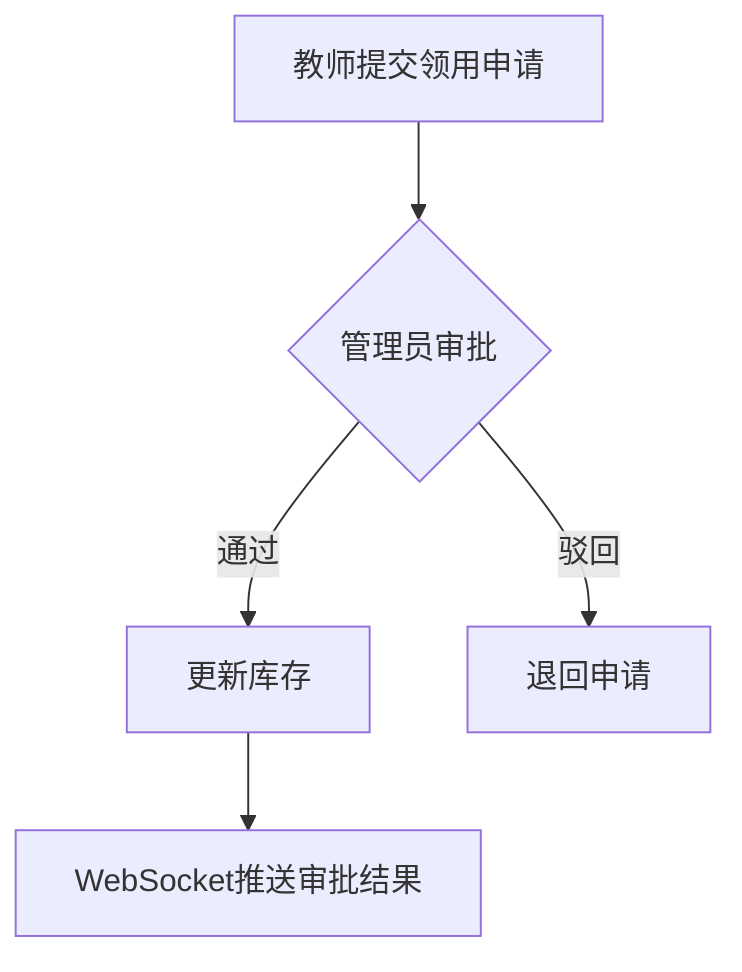

# 🧪 实验室管理系统

基于 Spring Boot 的实验室综合管理系统，支持药品管理、药品使用审批、实验室预约审批等核心功能，采用 RBAC 权限模型，支持实时消息推送和流程审批。

---

## 📋 项目简介

本系统面向高校及科研机构实验室管理场景，实现以下核心业务流程：

- **药品全生命周期管理**（采购登记 → 入库 → 使用审批 → 出库）
- **实验室预约调度**（预约申请 → 审批 → 使用记录）
- **多角色权限控制**（管理员 / 教师 / 学生）

---

## 🚀 主要功能模块

### 1. 药品管理（RBAC权限控制）

| 角色    | 权限说明                          |
|---------|-----------------------------------|
| 管理员  | 增删改查所有药品信息              |
| 教师    | 查看全部药品 + 申请领用           |
| 学生    | 只读药品库存信息                  |

**核心功能：**
- 药品分类管理（危险品/普通试剂）
- 库存预警机制（自动提醒临界库存）
- 操作日志追踪（记录操作人/IP/时间）

### 2. 药品使用审批



**技术实现：**
- 使用 **Redis** 缓存待审批队列
- **WebSocket + STOMP** 实现实时消息推送
- 审批记录持久化到 MySQL

### 3. 实验室预约审批

- **预约规则：**
  - 提前 7 天预约
  - 单次使用 ≤ 4 小时
  - 设备使用需绑定实验人员

- **冲突检测SQL：**
  ```sql
  SELECT * FROM reservations 
  WHERE lab_id = ? 
  AND NOT (end_time <= #{start} OR start_time >= #{end})
  ```

---

## 🛠️ 技术架构

### 技术栈全景图

```
Frontend: Thymeleaf + Bootstrap 5 + Axios
Backend: Spring Boot 2.7 + Spring Security
Database: MySQL 8.0 + Redis 6.0
Message: WebSocket + STOMP
Build: Maven 3.8
```

### 核心依赖

```xml
<!-- 安全控制 -->
<dependency>
    <groupId>org.springframework.boot</groupId>
    <artifactId>spring-boot-starter-security</artifactId>
</dependency>

<!-- 页面渲染 -->
<dependency>
    <groupId>org.springframework.boot</groupId>
    <artifactId>spring-boot-starter-thymeleaf</artifactId>
</dependency>

<!-- 数据库连接 -->
<dependency>
    <groupId>mysql</groupId>
    <artifactId>mysql-connector-java</artifactId>
</dependency>
<dependency>
    <groupId>org.springframework.boot</groupId>
    <artifactId>spring-boot-starter-data-redis</artifactId>
</dependency>
```

---

## 📦 安装部署

### 环境要求
- Java 11+
- MySQL 8.0+
- Redis 6.0+

### 配置步骤

1. 创建数据库
   ```sql
   CREATE DATABASE lab_management;
   USE lab_management;
   SOURCE src/main/resources/schema.sql;
   ```

2. 修改配置文件
   ```properties
   # application.properties
   spring.datasource.url=jdbc:mysql://localhost:3306/lab_management
   spring.datasource.username=root
   spring.datasource.password=your_password
   spring.redis.host=localhost
   ```

3. 启动项目
   ```bash
   mvn clean package
   java -jar target/lab-management.jar
   ```

---

## 📖 使用说明

### 登录凭证示例

| 角色    | 用户名 | 密码  |
|---------|--------|-------|
| 管理员  | admin  | 123456|
| 教师    | teacher| 123456|
| 学生    | student| 123456|

### 功能路径映射

| 功能                | 访问路径          |
|---------------------|-------------------|
| 药品管理            | /drugs            |
| 使用申请            | /applications     |
| 审批中心            | /approvals        |
| 实验室预约          | /reservations     |

---

## 📈 未来规划

### 待扩展功能
- [ ] 实验设备管理系统
- [ ] 实验数据存档模块
- [ ] 移动端适配界面
- [ ] 数据可视化仪表盘
- [ ] 多实验室集群管理

### 架构演进方向
- 引入 ELK 日志分析体系
- 拆分为微服务架构（Spring Cloud）
- 增加移动端 PWA 支持

---

## 📚 文档索引
- [数据库设计文档](docs/database.md)
- [API 接口文档](docs/api.md)
- [权限模型说明](docs/rbac.md)
- [部署手册](docs/deploy.md)

---

> 💡 版本迭代请关注 [CHANGELOG.md](CHANGELOG.md)  
> 🤝 贡献代码请参阅 [CONTRIBUTING.md](CONTRIBUTING.md)


